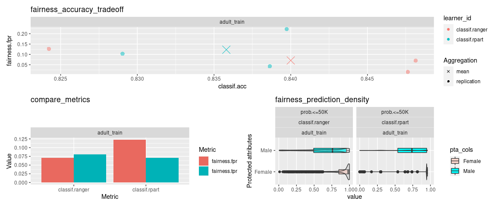

# [mlr3fairness](https://github.com/mlr-org/mlr3fairness) 

Machine Learning Fairness Extension for
[mlr3](https://github.com/mlr-org/mlr3).

[](https://github.com/mlr-org/mlr3fairness/actions/workflows/r-cmd-check.yml)
[](https://CRAN.R-project.org/package=mlr3fairness)
[](https://stackoverflow.com/questions/tagged/mlr3)
[](https://lmmisld-lmu-stats-slds.srv.mwn.de/mlr_invite/)

## Installation

Install the development version from github:

``` r
remotes::install_github("mlr-org/mlr3fairness")
```

## Why should I care about fairness in machine learning?

Machine Learning model predictions can be skewed by a range of factors
and thus might be considered unfair towards certain groups or
individuals. An example would be the COMPAS algorithm, which is a
popular commercial algorithm used by judges and parole officers for
scoring criminal defendant’s likelihood of reoffending (recidivism).
[Studies](https://www.propublica.org/article/machine-bias-risk-assessments-in-criminal-sentencing)
have shown, that the algorithm might be biased in favor of white
defendants. Biases can occur in a large variety of situations where
algorithms automate or support human decision making e.g. credit checks,
automatic HR tools along with a variety of other domains.

The **goal of `mlr3fairness`** is to allow for auditing of `mlr3`
learners, visualization and subsequently trying to improve fairness
using debiasing strategies.

--- 

:warning: **Note** Bias auditing and debiasing solely based on
observational data **can not** guarantee fairness of a decision making
system. Several biases, for example comming from the data can not be
detected using the approaches implemented in `mlr3fairness`. The goal
of this software is **instead** to allow for a better understanding and first
hints at possible fairness problems in a studied model.

---

## Feature Overview

- [**Fairness Measures:**](#fairness-metrics) Audit algorithmms for
  fairness using a variety of fairness criteria. This also allows for
  designing custom criteria.

- [**Fairness Visualizations:**](#fairness-visualizations) Diagnose
  fairness problems through visualizations.

- [**Debiasing Methods:**](#debiasing-methods) Correct fairness problems
  in three lines of code.

- [**Fairness Report:**](#model-cards--datasheets) Obtain a report
  regarding an algorithm’s fairness. (Under development)

**More Information**

- [Debiasing](https://mlr3fairness.mlr-org.com/articles/debiasing-vignette.html)
- [Fairness
  Metrics](https://mlr3fairness.mlr-org.com/articles/measures-vignette.html)
- [Visualizations](https://mlr3fairness.mlr-org.com/articles/visualization-vignette.html)
- [Reports](https://mlr3fairness.mlr-org.com/articles/reports-vignette.html)

### Protected Attribute

`mlr3fairness` requires information about the protected attribute wrt.
which we want to assess fairness. This can be set via the `col_role`
“pta” (protected attribute).

``` r
task$col_roles$pta = "variable_name"
```

In case a non-categorical or more complex protected attribute is
required, it can be manually computed and added to the task.
`mlr3fairness` does not require specific types for `pta`, but will
compute one metric for every unique value in the `pta` column.

### Fairness Metrics

`mlr3fairness` offers a variety of fairness metrics. Metrics are
prefixed with `fairness.` and can be found in the `msr()` dictionary.
Most fairness metrics are based on a difference between two protected
groups (e.g. male and female) for a given metric (e.g. the false
positive rate: `fpr`). See [the
vignette](https://textbook.coleridgeinitiative.org/chap-bias.html) for a
more in-depth introduction to fairness metrics and how to choose them.

``` r
library(mlr3)
library(mlr3fairness)
```

| key                  | description                                                                                               |
|:---------------------|:----------------------------------------------------------------------------------------------------------|
| fairness.acc         | Absolute differences in accuracy across groups                                                            |
| fairness.mse         | Absolute differences in mean squared error across groups                                                  |
| fairness.fnr         | Absolute differences in false negative rates across groups                                                |
| fairness.fpr         | Absolute differences in false positive rates across groups                                                |
| fairness.tnr         | Absolute differences in true negative rates across groups                                                 |
| fairness.tpr         | Absolute differences in true positive rates across groups                                                 |
| fairness.npv         | Absolute differences in negative predictive values across groups                                          |
| fairness.ppv         | Absolute differences in positive predictive values across groups                                          |
| fairness.fomr        | Absolute differences in false omission rates across groups                                                |
| fairness.fp          | Absolute differences in false positives across groups                                                     |
| fairness.tp          | Absolute differences in true positives across groups                                                      |
| fairness.tn          | Absolute differences in true negatives across groups                                                      |
| fairness.fn          | Absolute differences in false negatives across groups                                                     |
| fairness.cv          | Difference in positive class prediction, also known as Calders-Wevers gap or demographic parity           |
| fairness.eod         | Equalized Odds: Mean of absolute differences between true positive and false positive rates across groups |
| fairness.pp          | Predictive Parity: Mean of absolute differences between ppv and npv across groups                         |
| fairness.acc_eod=.05 | Accuracy under equalized odds \< 0.05 constraint                                                          |
| fairness.acc_ppv=.05 | Accuracy under ppv difference \< 0.05 constraint                                                          |

Additional **custom fairness metrics** can be easily constructed, [the
vignette](https://textbook.coleridgeinitiative.org/chap-bias.html)
contains more details. The `fairness_tensor()` function can be used with
a `Prediction` in order to print group-wise confusion matrices for each
protected attribute group. We can furthermore measure fairrness in each
group separately using `MeasureSubgroup` and `groupwise_metrics`.

### Fairness Visualizations

Visualizations can be used with either a `Prediction`, `ResampleResult`
or a `BenchmarkResult`. For more information regarding those objects,
refer to the [mlr3 book](https://mlr3book.mlr-org.com/).

- **fairness_accuracy_tradeoff**: Plot available trade-offs between
  fairness and model performance.

- **compare_metrics**: Compare fairness across models and
  cross-validation folds.

- **fairness_prediction_density**: Density plots for each protected
  attribute.

<!-- -->

### Debiasing Methods

Debiasing methods can be used to improve the fairness of a given model.
`mlr3fairness` includes several methods that can be used together with
`mlr3pipelines` to obtain fair(er) models:

``` r
library(mlr3pipelines)
lrn = as_learner(po("reweighing_wts") %>>% lrn("classif.rpart"))
rs = resample(lrn, task = tsk("compas")$filter(1:500), rsmp("cv"))
rs$score(msr("fairness.acc"))
```

**Overview:**

| key            | output.num | input.type.train | input.type.predict | output.type.train |
|:---------------|-----------:|:-----------------|:-------------------|:------------------|
| EOd            |          1 | TaskClassif      | TaskClassif        | NULL              |
| reweighing_os  |          1 | TaskClassif      | TaskClassif        | TaskClassif       |
| reweighing_wts |          1 | TaskClassif      | TaskClassif        | TaskClassif       |

### Fair Learners

`mlr3fairness` furthermore contains several learners that can be used to
directly learn fair models:

| key               | package | reference             |
|:------------------|:--------|:----------------------|
| regr.fairfrrm     | fairml  | Scutari et al., 2021  |
| classif.fairfgrrm | fairml  | Scutari et al., 2021  |
| regr.fairzlm      | fairml  | Zafar et al., 2019    |
| classif.fairzlrm  | fairml  | Zafar et al., 2019    |
| regr.fairnclm     | fairml  | Komiyama et al., 2018 |

### Datasets

`mlr3fairness` includes two fairness datasets: `adult` and `compas`. See
`?adult` and `?compas` for additional information regarding columns.

You can load them using `tsk(<key>)`.

### Model Cards & Datasheets

An important step towards achieving more equitable outcomes for ML
models is adequate documentation for datasets and models in machine
learning. `mlr3fairness` comes with reporting aides for `models` and
`datasets`. This provides empty templates that can be used to create
interactive reports through `RMarkdown`.

| Report             | Description             | Reference             | Example                                                                    |
|--------------------|-------------------------|-----------------------|----------------------------------------------------------------------------|
| `report_modelcard` | Modelcard for ML models | Mitchell et al., 2018 | [link](https://mlr3fairness.mlr-org.com/articles/modelcard/modelcard.html) |
| `report_datasheet` | Datasheet for data sets | Gebru et al., 2018    | [link](https://mlr3fairness.mlr-org.com/articles/datasheet/datasheet.html) |
| `report_fairness`  | Fairness Report         | \-[^1]                | [link](https://mlr3fairness.mlr-org.com/articles/fairness/fairness.html)   |

**Usage:**

The `report_*` functions instantiate a new `.Rmd` template that contains
a set of pre-defined questions which can be used for reporting as well
as initial graphics. The goal is that a user extends this `.Rmd` file to
create comprehensive documentation for datasets, ML models or to
document a model’s fairness. It can later be converted into a `html`
report using`rmarkdown`’s `render`.

``` r
rmdfile = report_datasheet()
rmarkdown::render(rmdfile)
```

### Demo for Adult Dataset

We provide a short example detailing how `mlr3fairness` integrates with
the `mlr3` ecosystem.

``` r
library(mlr3fairness)

#Initialize Fairness Measure
fairness_measure = msr("fairness.fpr")
#Initialize tasks
task_train = tsk("adult_train")
task_test = tsk("adult_test")
#Initialize model
learner = lrn("classif.rpart", predict_type = "prob")

#Verify fairness metrics
learner$train(task_train)
predictions = learner$predict(task_test)
predictions$score(fairness_measure, task = task_test)

#Visualize the predicted probability score based on protected attribute.
fairness_prediction_density(predictions, task_test)
```

### Extensions

- The [mcboost](https://github.com/mlr-org/mcboost) package integrates
  with **mlr3** and offers additional debiasing post-processing
  functionality for **classification**, **regression** and **survival**.

### Other Fairness Toolkits in R

- The [AI Fairness 360](https://aif360.mybluemix.net/) toolkit offers an
  R extension that allows for bias auditing, visualization and
  mitigation.
- [fairmodels](https://github.com/ModelOriented/fairmodels/) integrates
  with the [DALEX](https://github.com/ModelOriented/DALEX) R-packages
  and similarly allows for bias auditing, visualization and mitigation.
- The [fairness](https://github.com/kozodoi/fairness) package allows for
  bias auditing in R.
- The [fairml](https://cran.r-project.org/package=fairml) package
  contains methods for learning de-biased regression and classification
  models. Learners from `fairml` are included as learners in
  `mlr3fairness`.

### Other Fairness Toolkits

- [Aequitas](http://aequitas.dssg.io/) Allows for constructing a
  fairness report for different fairness metrics along with
  visualization in Python.
- [fairlearn](https://fairlearn.org/) Allows for model auditing and
  debiasing as well as visualization in Python.
- [AI Fairness 360](https://github.com/Trusted-AI/AIF360) Allows for
  model auditing and debiasing as well as visualization in R and Python.

### Future Development

Several future developments are currently planned. Contributions are
highly welcome!

- Visualizations: Improvement on visualizations, like anchor points and
  others. See issues.
- Debiasing Methods: More debiasing methods, post-processing and
  in-processing.

## Bugs, Feedback and Questions

`mlr3fairness` is a free and open source software project that
encourages participation and feedback. If you have any issues,
questions, suggestions or feedback, please do not hesitate to open an
“issue” about it on the GitHub page! In case of problems / bugs, it is
often helpful if you provide a “minimum working example” that showcases
the behaviour.

[^1]: The fairness report is inspired by the [Aequitas Bias
    report](http://aequitas.dssg.io/example.html).
