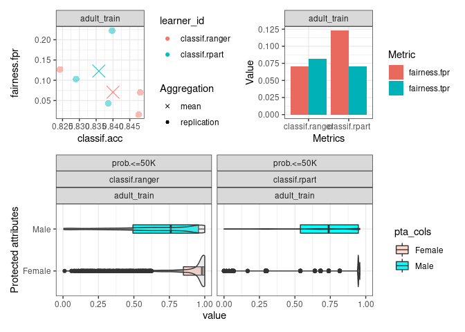

# [mlr3fairness](https://github.com/mlr-org/mlr3fairness)

Machine Learning Fairness Extension for
[mlr3](https://github.com/mlr-org/mlr3).

[](https://github.com/mlr-org/mlr3fairness/actions)
[](https://stackoverflow.com/questions/tagged/mlr3)
[](https://lmmisld-lmu-stats-slds.srv.mwn.de/mlr_invite/)

## Installation

Install the development version from mlr3 repo

``` r
remotes::install_github("mlr-org/mlr3fairness")
```

## Why should I care about fairness in machine learning?

Machine Learning model predictions can be skewed by a range of factors
and thus might be considered unfair towards certain groups or
individuals. An example would be the COMPAS algorithm, which is a
popular commercial algorithm used by judges and parole officers for
scoring criminal defendant’s likelihood of reoffending (recidivism).
[Studies](https://www.propublica.org/article/machine-bias-risk-assessments-in-criminal-sentencing)
have shown, that the algorithm might be biased in favor of white
defendants. Biases can occur in a large variety of situations where
algorithms automate or support human decision making e.g. credit checks,
automatic HR tools along with a variety of other domains.

The **goal of `mlr3fairness`** is to allow for auditing of `mlr3`
learners, visualization and subsequently trying to improve fairness
using debiasing strategies.

## Feature Overview

  - **Fairness Measures:** Audit algorithmms for fairness using a
    variety of fairness criteria. This also allows for designing custom
    criteria.

  - **Fairness Visualizations:** Diagnose fairness problems through
    visualizations.

  - **Debiasing Methods:** Correct fairness problems in three lines of
    code.

  - **Fairness Report:** Obtain a report regarding an algorithm’s
    fairness. (Under development)

**More Information**

  - [Debiasing](https://mlr3fairness.mlr-org.com/articles/debiasing-vignette.html)
  - [Fairness
    Metrics](https://mlr3fairness.mlr-org.com/articles/measures-vignette.html)
  - [Visualizations](https://mlr3fairness.mlr-org.com/articles/visualization-vignette.html)

### Protected Attribute

`mlr3fairness` requires information about the protected attribute wrt.
which we want to assess fairness. This can be set via the `col_role`
“pta” (protected attribute). Currently `mlr3fairness` allows only a
single column as `"pta"`.

``` r
task$col_roles$pta = "variable_name"
```

In case a non-categorical or more complex protected attribute is
required, it can be manually computed and added to the task.
`mlr3fairness` does not require specific types for `pta`, but will
compute one metric for every unique value in the `pta` column.

### Fairness Metrics

`mlr3fairness` offers a variety of fairness metrics. Metrics are
prefixed with `fairness.` and can be found in the `msr()` dictionary.
Most fairness metrics are based on a difference between two protected
groups (e.g. male and female) for a given metric (e.g. the false
positive rate: `fpr`). See
[here](https://textbook.coleridgeinitiative.org/chap-bias.html) for a
more in-depth introduction to fairness metrics and how to choose them.

``` r
library(mlr3)
library(mlr3fairness)
```

| key                                | description                                                           |
| :--------------------------------- | :-------------------------------------------------------------------- |
| fairness.eod                       | Equalized Odds: Sum of abs. difference between true positive and      |
| false positive rates across groups |                                                                       |
| fairness.fpr                       | Abs. difference in false positive rates across groups                 |
| fairness.acc                       | Abs. difference in accuracy across groups (Overall accuracy equality) |
| fairness.tpr                       | Abs. difference in true positive rates across groups                  |
| fairness.tnr                       | Abs. difference in true negative rates across groups                  |
| fairness.ppv                       | Abs. difference in positive predictive values across groups           |
| fairness.npv                       | Abs. difference in negative predictive values across groups           |
| fairness.fp                        | Abs. difference in false positives across groups                      |
| fairness.fn                        | Abs. difference in false negatives across groups                      |

The `fairness_tensor` function can be used with a `Prediction` in order
to print group-wise confusion matrices for each protected attribute
group.

### Fairness Visualizations

Visualizations can be used with either a `Prediction`, `ResampleResult`
or a `BenchmarkResult`. For more information regarding those objects,
refer to the [mlr3 book](https://mlr3book.mlr-org.com/basics.html).

  - **fairness\_accuracy\_tradeoff**: Plot available trade-offs between
    fairness and model performance.

  - **compare\_metrics**: Compare fairness across models and
    cross-validation folds.

  - **fairness\_prediction\_density**: Density plots for each protected
    attribute.

<!-- -->

### Debiasing Methods

Debiasing methods can be used to improve the fairness of a given model.
`mlr3fairness` includes several methods that can be used together with
`mlr3pipelines` to obtain fair(er) models:

``` r
library(mlr3pipelines)
lrn = as_learner(po("reweighing_wts") %>>% lrn("classif.rpart"))
rs = resample(lrn, task = tsk("compas")$filter(1:500), rsmp("cv"))
rs$score(msr("fairness.acc"))
```

**Overview:**

| key             | input.type.train | input.type.predict | output.type.train | output.type.predict |
| :-------------- | :--------------- | :----------------- | :---------------- | :------------------ |
| EOd             | TaskClassif      | TaskClassif        | NULL              | PredictionClassif   |
| reweighing\_os  | TaskClassif      | TaskClassif        | TaskClassif       | TaskClassif         |
| reweighing\_wts | TaskClassif      | TaskClassif        | TaskClassif       | TaskClassif         |

### Datasets

`mlr3fairness` includes two fairness datasets: `adult` and `compas`. See
`?adult` and `?compas` for additional information regarding columns.

You can load them using `tsk(<key>)`.

### Demo for Adult Dataset

We provide a short example detailing how `mlr3fairness` integrates with
the `mlr3` ecosystem.

``` r
library(mlr3fairness)

#Initialize Fairness Measure
fairness_measure = msr("fairness.fpr")
#Initialize tasks
task_train = tsk("adult_train")
task_test = tsk("adult_test")
#Initialize model
learner = lrn("classif.rpart", predict_type = "prob")

#Verify fairness metrics
learner$train(task_train)
predictions = learner$predict(task_test)
predictions$score(fairness_measure, task = task_test)

#Visualize the predicted probability score based on protected attribute.
fairness_prediction_density(predictions, task_test)
```

### Model Cards & Datasheets

An important step towards achieving more equitable outcomes for ML
models is adequate documentation for datasets and models in machine
learning. `mlr3fairness` comes with reporting aides for `models` and
`datasets`. This provides empty templates that can be used to create
interactive reports through `RMarkdown`.

| Report              | Description             | Reference             |
| ------------------- | ----------------------- | --------------------- |
| `report_modelcard`  | Modelcard for ML models | Mitchell et al., 2018 |
| `repoort_datasheet` | Datasheet for data sets | Gebru et al., 2018    |

**Usage:**

The `report_*` functions instantiate a new `.Rmd` template that contains
a set of pre-defined questions which can be used for reporting. It can
later be converted into a `html` report using `rmarkdown`’s `render`.

``` r
report_datasheet()
rmarkdown::render("datasheet/datasheet.Rmd")
```

### Extensions

  - The [mcboost](https://github.com/mlr-org/mcboost) package integrates
    with **mlr3** and offers additional debiasing post-processing
    functionality for **classification**, **regression** and
    **survival**.

### Other Fairness Toolkits in R

  - The [AI Fairness 360](https://aif360.mybluemix.net/) toolkit offers
    an R extension that allows for bias auditing, visualization and
    mitigation.
  - The [Fairmodels](https://github.com/ModelOriented/fairmodels/)
    integrates with the [DALEX](https://github.com/ModelOriented/DALEX)
    R-packages and similarly allows for bias auditing, visualization and
    mitigation.
  - The [fairness](https://github.com/kozodoi/fairness) package allows
    for bias auditing in R.

### Future Development

Several future developments are currently planned. Contributions are
highly welcome\!

  - Visualizations: Improvement on visualizations, like anchor points
    and others. See issues.
  - Metrics: Add support to non-binary target attributes and non-binary
    protected attributes.
  - Debiasing Methods: More Debiasing Methods, post-processing and
    in-processing.
  - Fairness Report: Add a `report_fairness` that automatically creates
    a **fairness report**

## Bugs, Feedbacks and Questions

`mlr3fairness` is a free and open source software project that
encourages participation and feedback. If you have any issues,
questions, suggestions or feedback, please do not hesitate to open an
“issue” about it on the GitHub page\! In case of problems / bugs, it
is often helpful if you provide a “minimum working example” that
showcases the behaviour.
