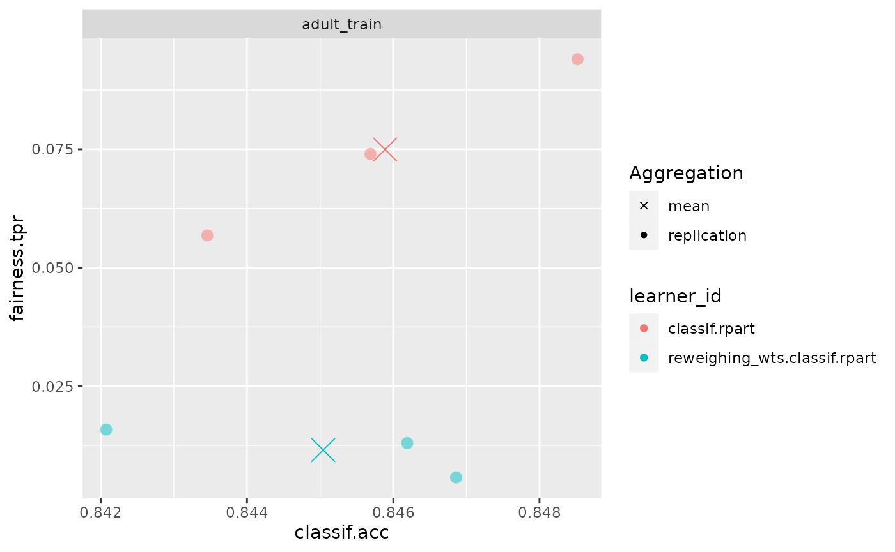

# Debiasing Methods

## Introduction: Fairness Pipeline Operators

Given we detected some form of bias during bias auditing, we are often
interested in obtaining fair(er) models. There are several ways to
achieve this, such as collecting additional data or finding and fixing
errors in the data. Assuming there are no biases in the data and labels,
one other option is to debias models using either **preprocessing**,
**postprocessing** and **inprocessing** methods. `mlr3fairness` provides
some operators as `PipeOp`s for `mlr3pipelines`. If you are not familiar
with `mlr3pipelines`, the [mlr3
book](https://mlr3book.mlr-org.com/chapters/chapter7/sequential_pipelines.html)
contains an introduction.

We again showcase debiasing using the `adult_train` task:

``` r
library(mlr3)
library(mlr3fairness)
library(mlr3pipelines)

task = tsk("adult_train")
```

## Reweighing algorithms

`mlr3fairness` implements 2 reweighing-based algorithms:
`reweighing_wts` and `reweighing_os`. `reweighing_wts` adds observation
weights to a `Task` that can counteract imbalances between the
conditional probabilities $P\left( Y|pta \right)$.

| key            | output.num | input.type.train | input.type.predict | output.type.train |
|:---------------|-----------:|:-----------------|:-------------------|:------------------|
| EOd            |          1 | TaskClassif      | TaskClassif        | NULL              |
| reweighing_os  |          1 | TaskClassif      | TaskClassif        | TaskClassif       |
| reweighing_wts |          1 | TaskClassif      | TaskClassif        | TaskClassif       |

We fist instantiate the `PipeOp`:

``` r
p1 = po("reweighing_wts")
```

and directly add the weights:

``` r
t1 = p1$train(list(task))[[1]]
```

Often we directly combine the `PipeOp` with a `Learner` to automate the
preprocessing (see `learner_rw`). Below we instantiate a small benchmark

``` r
set.seed(4321)
learner = lrn("classif.rpart", cp = 0.005)
learner_rw = as_learner(po("reweighing_wts") %>>% learner)
grd = benchmark_grid(list(task), list(learner, learner_rw), rsmp("cv", folds=3))
bmr = benchmark(grd)
```

We can now compute the metrics for our benchmark and see if reweighing
actually improved fairness, measured via True Positive Rate (TPR) and
classification accuracy (ACC):

``` r
bmr$aggregate(msrs(c("fairness.tpr", "fairness.acc")))
#>       nr     task_id                   learner_id resampling_id iters
#>    <int>      <char>                       <char>        <char> <int>
#> 1:     1 adult_train                classif.rpart            cv     3
#> 2:     2 adult_train reweighing_wts.classif.rpart            cv     3
#>    fairness.tpr fairness.acc
#>           <num>        <num>
#> 1:   0.07494903    0.1162688
#> 2:   0.01151982    0.1054431
#> Hidden columns: resample_result
```

``` r
fairness_accuracy_tradeoff(bmr, msr("fairness.tpr"))
```



Our model became way fairer wrt. TPR but minimally worse wrt. accuracy!
