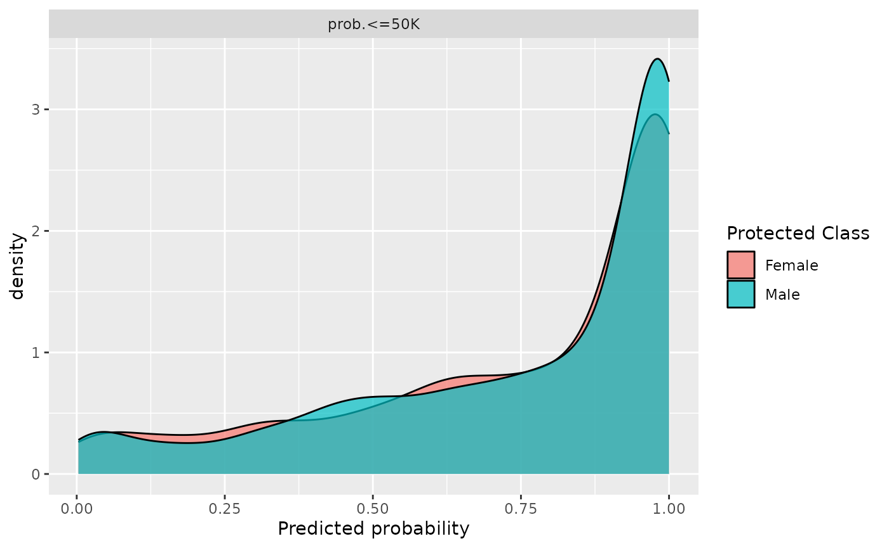
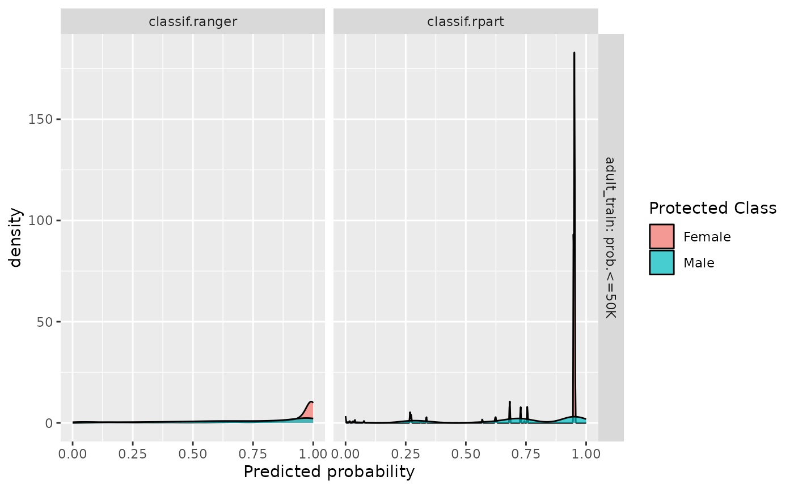
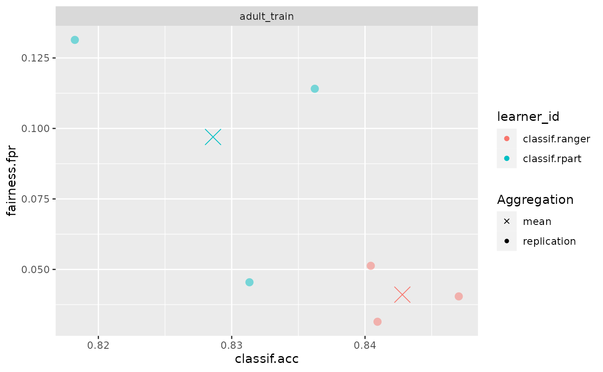
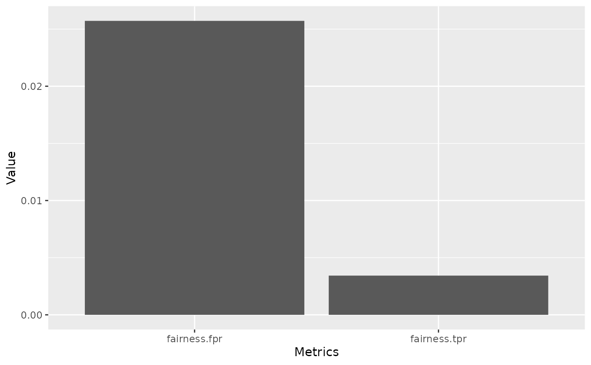
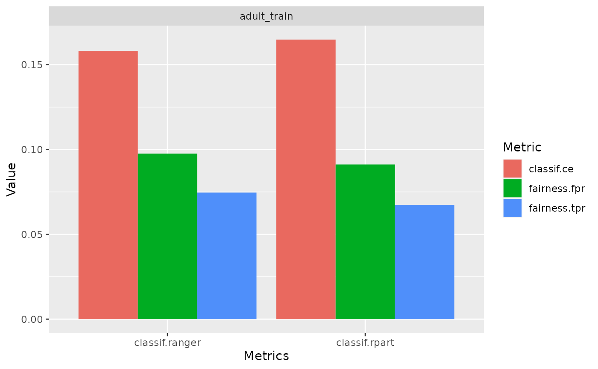
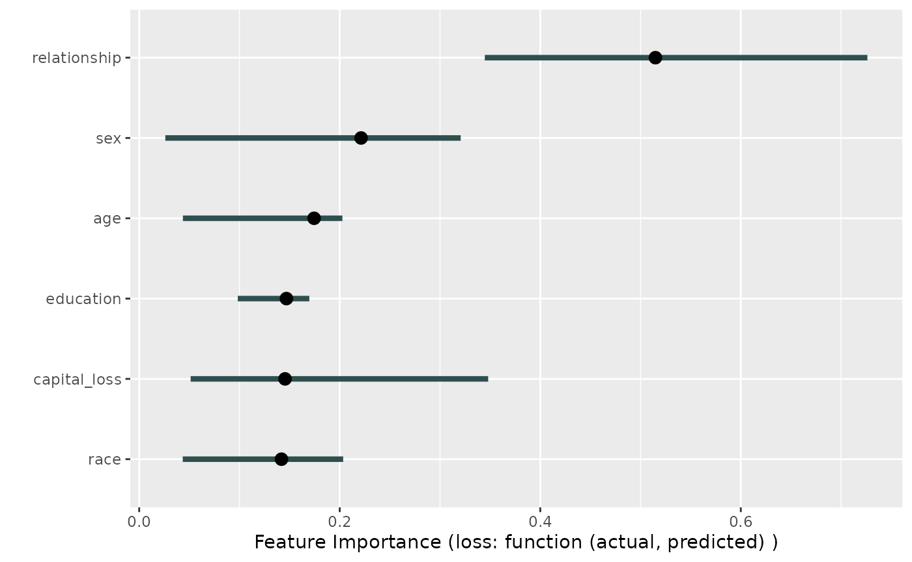

# Fairness Visualizations

``` r
library(mlr3)
library(mlr3fairness)
library(mlr3learners)
```

## Why we need fairness visualizations:

Through fairness visualizations allow for first investigations into
possible fairness problems in a dataset. In this vignette we will
showcase some of the pre-built fairness visualization functions. All the
methods showcased below can be used together with objects of type
`BenchmarkResult`, `ResampleResult` and `Prediction`.

## The scenario

For this example, we use the `adult_train` dataset. Keep in mind all the
datasets from `mlr3fairness` package already set protected attribute via
the `col_role` “pta”, here the “sex” column.

``` r
t = tsk("adult_train")
t$col_roles$pta
#> [1] "sex"
```

We choose a random forest as well as a decision tree model in order to
showcase differences in performances.

``` r
task = tsk("adult_train")$filter(1:5000)
learner = lrn("classif.ranger", predict_type = "prob")
learner$train(task)
predictions = learner$predict(tsk("adult_test")$filter(1:5000))
```

Note, that it is important to evaluate predictions on held-out data in
order to obtain unbiased estimates of fairness and performance metrics.
By inspecting the confusion matrix, we can get some first insights.

``` r
predictions$confusion
#>         truth
#> response <=50K >50K
#>    <=50K  3496  490
#>    >50K    264  750
```

We furthermore design a small experiment allowing us to compare a random
forest (`ranger`) and a decision tree (`rpart`). The result, `bmr` is a
`BenchmarkResult` that contains the trained models on each
cross-validation split.

``` r
design = benchmark_grid(
  tasks = tsk("adult_train")$filter(1:5000),
  learners = lrns(c("classif.ranger", "classif.rpart"),
                  predict_type = "prob"),
  resamplings = rsmps("cv", folds = 3)
)

bmr = benchmark(design)
```

## Fairness Prediction Density Plot

By inspecting the prediction density plot we can see the predicted
probability for a given class split by the protected attribute, in this
case `"sex"`. Large differences in densities might hint at strong
differences in the target between groups, either directly in the data or
as a consequence of the modeling process. Note, that plotting densities
for a `Prediction` requires a `Task` since information about protected
attributes is not contained in the `Prediction`.

We can either plot the density with a `Prediction`

``` r
fairness_prediction_density(predictions, task)
```



or use it with a `BenchmarkResult` / `ResampleResult`:

``` r
fairness_prediction_density(bmr)
```



## Fairness Accuracy Tradeoff Plot

In practice, we are most often interested in a trade-off between
fairness metrics and a measure of utility such as accuracy. We showcase
individual scores obtained in each cross-validation fold as well as the
aggregate (`mean`) in order to additionally provide an indication in the
variance of the performance estimates.

``` r
fairness_accuracy_tradeoff(bmr, msr("fairness.fpr"))
```



## Fairness Comparison Plot

An additional comparison can be obtained using `compare_metrics`. It
allows comparing `Learner`s with respect to multiple metrics. Again, we
can use it with a `Prediction`:

``` r
compare_metrics(predictions, msrs(c("fairness.fpr", "fairness.tpr")), task)
```



or use it with a `BenchmarkResult` / `ResampleResult`:

``` r
compare_metrics(bmr, msrs(c("classif.ce", "fairness.fpr", "fairness.tpr")))
```



## Custom visualizations

The required metrics to create custom visualizations can also be easily
computed using the `$score()` method.

``` r
bmr$score(msr("fairness.tpr"))
#>       nr     task_id     learner_id resampling_id iteration     prediction_test
#>    <int>      <char>         <char>        <char>     <int>              <list>
#> 1:     1 adult_train classif.ranger            cv         1 <PredictionClassif>
#> 2:     1 adult_train classif.ranger            cv         2 <PredictionClassif>
#> 3:     1 adult_train classif.ranger            cv         3 <PredictionClassif>
#> 4:     2 adult_train  classif.rpart            cv         1 <PredictionClassif>
#> 5:     2 adult_train  classif.rpart            cv         2 <PredictionClassif>
#> 6:     2 adult_train  classif.rpart            cv         3 <PredictionClassif>
#>    fairness.tpr
#>           <num>
#> 1:   0.06883238
#> 2:   0.06602544
#> 3:   0.08978175
#> 4:   0.05817107
#> 5:   0.06701629
#> 6:   0.08970016
#> Hidden columns: uhash, task, learner, resampling
```

## Interpretability

Fairness metrics, in combination with tools from interpretable machine
learning can help pinpointing sources of bias. In the following example,
we try to figure out which variables have a high feature importance for
the difference in `classif.eod`, the equalized odds difference. In the
following example

``` r
set.seed(432L)
library("iml")
library("mlr3fairness")

learner = lrn("classif.rpart", predict_type = "prob")
task = tsk("adult_train")
# Make the task smaller:
task$filter(sample(task$row_ids, 2000))
task$select(c("sex", "relationship", "race", "capital_loss", "age", "education"))
target = task$target_names
learner$train(task)

model = Predictor$new(model = learner,
                      data = task$data()[,.SD, .SDcols = !target],
                      y = task$data()[, ..target])

custom_metric = function(actual, predicted) {
  compute_metrics(
    data = task$data(),
    target = task$target_names,
    protected_attribute = task$col_roles$pta,
    prediction = predicted,
    metrics = msr("fairness.eod")
  )
}

imp <- FeatureImp$new(model, loss = custom_metric, n.repetitions = 5L)
plot(imp)
#> Warning: Using `size` aesthetic for lines was deprecated in ggplot2 3.4.0.
#> ℹ Please use `linewidth` instead.
#> ℹ The deprecated feature was likely used in the iml package.
#>   Please report the issue at <https://github.com/giuseppec/iml/issues>.
#> This warning is displayed once per session.
#> Call `lifecycle::last_lifecycle_warnings()` to see where this warning was
#> generated.
```



We can now investigate this variable a little deeper by looking at the
distribution of labels in each of the two groups.

``` r
data = task$data()
data[, setNames(as.list(summary(relationship)/.N),levels(data$relationship)), by = "sex"]
#>       sex  Husband Not-in-family Other-relative Own-child  Unmarried      Wife
#>    <fctr>    <num>         <num>          <num>     <num>      <num>     <num>
#> 1: Female 0.000000     0.3662420     0.03980892 0.1671975 0.26910828 0.1576433
#> 2:   Male 0.611516     0.2048105     0.02332362 0.1231778 0.03717201 0.0000000
```

We can see, that the different levels are skewed across groups, e.g. 25%
of females in our data are unmarried in contrast to 3% of males are
unmarried.
