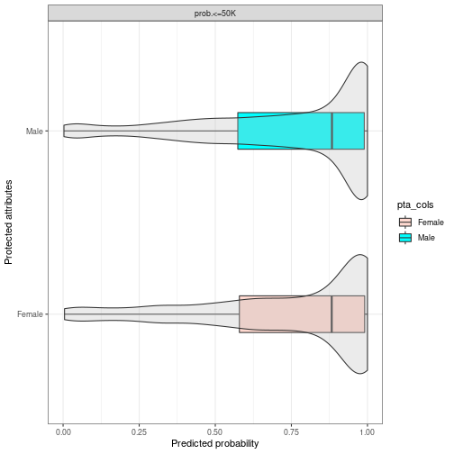
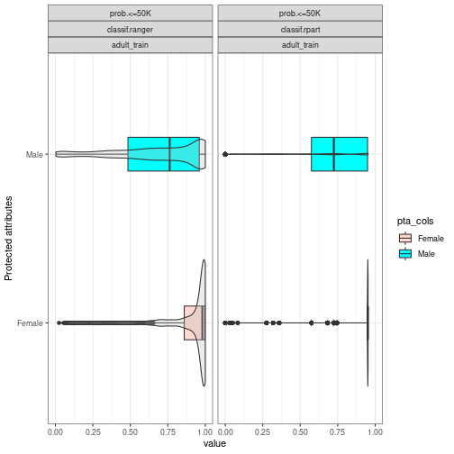
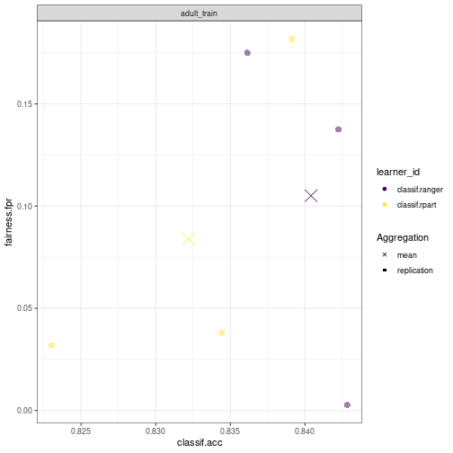
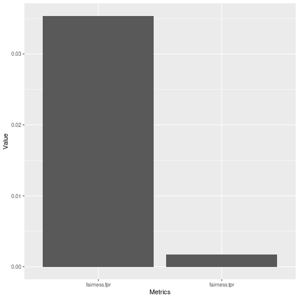

```r
library(mlr3fairness)
library(mlr3learners)
library(mlr3)
```

# Why we need fairness visualizations:

Through fairness visualizations allow for first investigations into possible fairness problems in a dataset. In this vignette we will showcase some of the pre-built fairness visualization functions.
All of the methods showcased below can be used together with objects of type `BenchmarkResult`, `ResampleResult` and `Prediction`.

# The scenario

For this example, we use the `adult_train` dataset.
Keep in mind all the datasets from mlr3fairness package already set protected attribute via the `col_role` "pta", here the "sex" column.


```r
t = tsk("adult_train")
t$col_roles$pta
#> [1] "sex"
```
We choose a random forest as well as a decision tree model in order to showcase differences in performances.


```r
task = tsk("adult_train")$filter(1:5000)
learner = lrn("classif.ranger", predict_type = "prob")
learner$train(task)
predictions = learner$predict(tsk("adult_test")$filter(1:5000))
```
Note, that it is important to evaluate predictions on held-out data in order to obtain unbiased estimates of fairness and performance metrics.
By inspecting the confusion matrix, we can get some first insights.


```r
predictions$confusion
#>         truth
#> response <=50K >50K
#>    <=50K  3492  486
#>    >50K    268  754
```

We furthermore design a small experiment allowing us to compare a random forest (`ranger`) and a decision tree (`rpart`). The result, `bmr` is a `BenchmarkResult` that contains the trained models on each cross-validation split.


```r
design = benchmark_grid(
  tasks = tsk("adult_train")$filter(1:5000),
  learners = lrns(c("classif.ranger", "classif.rpart"),
                  predict_type = "prob"),
  resamplings = rsmps("cv", folds = 3)
)

bmr = benchmark(design)
#> INFO  [12:09:31.482] [mlr3] Running benchmark with 6 resampling iterations 
#> INFO  [12:09:31.489] [mlr3] Applying learner 'classif.rpart' on task 'adult_train' (iter 2/3) 
#> INFO  [12:09:31.565] [mlr3] Applying learner 'classif.rpart' on task 'adult_train' (iter 3/3) 
#> INFO  [12:09:31.696] [mlr3] Applying learner 'classif.ranger' on task 'adult_train' (iter 2/3) 
#> INFO  [12:09:32.557] [mlr3] Applying learner 'classif.rpart' on task 'adult_train' (iter 1/3) 
#> INFO  [12:09:32.628] [mlr3] Applying learner 'classif.ranger' on task 'adult_train' (iter 3/3) 
#> INFO  [12:09:33.478] [mlr3] Applying learner 'classif.ranger' on task 'adult_train' (iter 1/3) 
#> INFO  [12:09:34.260] [mlr3] Finished benchmark
```

# Fairness Prediction Density Plot

By inspecting the prediction density plot we can see the predicted probability for a given class split by the protected attribute, in this case `"sex"`. Large differences in densities might hint at strong differences in the target between groups, either directly in the data or as a consequence of the modeling process. Note, that plotting densities for a `Prediction`
requires a `Task` since information about protected attributes is not contained in the `Prediction`.

We can either plot the density with a `Prediction`

```r
fairness_prediction_density(predictions, task)
```



or use it with a `BenchmarkResult` / `ResampleResult`:


```r
fairness_prediction_density(bmr)
```



# Fairness Accuracy Tradeoff Plot

In practice, we are most often interested in a trade-off between fairness metrics and a measure of utility such as accuracy.
We showcase individual scores obtained in each cross-validation fold as well as the aggregate (`mean`) in order to additionally provide an indication in the variance of the performance estimates.


```r
fairness_accuracy_tradeoff(bmr, msr("fairness.fpr"))
```



# Fairness Comparison Plot

An additional comparison can be obtained using `compare_metrics`. It allows comparing `Learner`s with respect to multiple metrics.
Again, we can use it with a `Prediction`:


```r
compare_metrics(predictions, msrs(c("fairness.fpr", "fairness.tpr")), task)
```



or use it with a `BenchmarkResult` / `ResampleResult`:


```r
compare_metrics(bmr, msrs(c("classif.mmce", "fairness.fpr", "fairness.tpr")))
#> Error: Element with key 'classif.mmce' not found in DictionaryMeasure! Did you mean 'classif.ce' / 'classif.mcc' / 'classif.acc'?
```

# Custom visualizations

The required metrics to create custom visualizations can also be easily computed using the `$score()` method.


```r
bmr$score(msr("fairness.tpr"))
#>                                   uhash nr              task     task_id
#> 1: f764b148-0dd2-4f03-9261-7286c49671d6  1 <TaskClassif[48]> adult_train
#> 2: f764b148-0dd2-4f03-9261-7286c49671d6  1 <TaskClassif[48]> adult_train
#> 3: f764b148-0dd2-4f03-9261-7286c49671d6  1 <TaskClassif[48]> adult_train
#> 4: 8f6af348-f39e-4abd-a562-a8eba5d42ded  2 <TaskClassif[48]> adult_train
#> 5: 8f6af348-f39e-4abd-a562-a8eba5d42ded  2 <TaskClassif[48]> adult_train
#> 6: 8f6af348-f39e-4abd-a562-a8eba5d42ded  2 <TaskClassif[48]> adult_train
#>                       learner     learner_id         resampling resampling_id
#> 1: <LearnerClassifRanger[36]> classif.ranger <ResamplingCV[19]>            cv
#> 2: <LearnerClassifRanger[36]> classif.ranger <ResamplingCV[19]>            cv
#> 3: <LearnerClassifRanger[36]> classif.ranger <ResamplingCV[19]>            cv
#> 4:  <LearnerClassifRpart[36]>  classif.rpart <ResamplingCV[19]>            cv
#> 5:  <LearnerClassifRpart[36]>  classif.rpart <ResamplingCV[19]>            cv
#> 6:  <LearnerClassifRpart[36]>  classif.rpart <ResamplingCV[19]>            cv
#>    iteration              prediction fairness.tpr
#> 1:         1 <PredictionClassif[20]>   0.04059739
#> 2:         2 <PredictionClassif[20]>   0.09679333
#> 3:         3 <PredictionClassif[20]>   0.09103978
#> 4:         1 <PredictionClassif[20]>   0.05424446
#> 5:         2 <PredictionClassif[20]>   0.08215294
#> 6:         3 <PredictionClassif[20]>   0.05980328
```
